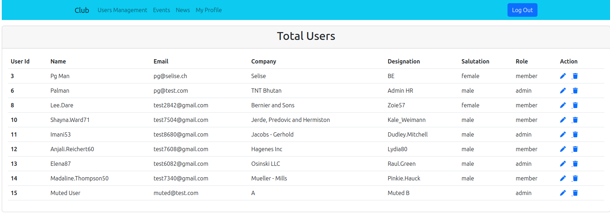

# README


## Initial Setup   

**Prerequisites**  

The setups steps:  
    - Git  
    - Ruby 3.1.4  
    - Rails 7.1.3  
    - sqlite3   
    - graphql 

**1. Check out the repository and install the needed gem** 

```
git clone git@github.com:Palman6/club_management.git
cd club_management
bundle install
```

**2. Install MiniMagick in your system**  
This gem is used for upload image so need to install in a system  .

``` 
sudo apt install imagemagick
```

**3. Setup database**  
```
rails db:create
rails db:migrate
```

**4. Emails**  
 Used Action Mailer for mailers and to view the email Letter Opener.

**5. To Execute test run the following command** 
```
 rspec
```

**6. Check Grapgql API** 
```
http://localhost:3000/graphiql
```

**7. Rails best practices and coding conventions**  
 Used RuboCop Rails.